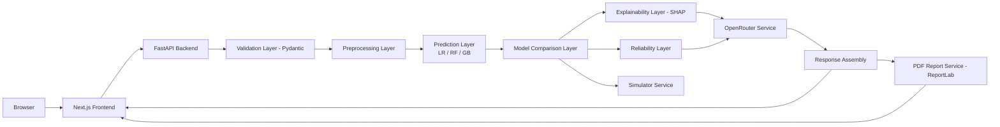

# CrediLens AI — Implementation Plan

## 1. Document Purpose

This document is the primary, implementation-ready engineering guide for building **CrediLens AI**, an explainable borrower risk assessment platform. It converts the project blueprint into an executable plan that can be followed step-by-step by a human engineering team and/or an AI coding assistant (e.g., Claude Code).

**Who uses this document**
- Engineers and data scientists implementing the platform end-to-end.
- AI coding assistants executing phases and tasks against the repository.
- Reviewers/PMs tracking progress against the Definition of Done (Section 26).

**How it should be followed**
- Work proceeds phase by phase, in the order defined in Section 8 and summarized in Section 27.
- No phase that depends on the dataset (Phase 1 outputs) may be started before Phase 1 is complete and documented.
- Every task should be committed in small, verifiable increments (see Section 25).
- Any deviation from a fixed decision (Section 3 of the blueprint / "Fixed Product Decisions") requires explicit user approval before implementation.

**What is fixed**
- The technology stack (frontend, backend, ML, explainability, LLM provider, PDF generation, deployment targets) is finalized and must not be substituted (see Section 3 below).
- The three-model comparison approach (Logistic Regression, Random Forest, Gradient Boosting) is fixed.
- Manual borrower entry only for the MVP; CSV upload, bank integration, bureau integration, and automated approval/rejection are explicitly out of scope.

**What remains dataset-dependent**
- Exact borrower input fields, target variable, class labels, feature lists, preprocessing steps, and risk thresholds are **not finalized** until the dataset audit (Phase 1) is complete. These items are explicitly marked `Dataset-dependent decision` throughout this document and must never be invented ahead of time.

**How progress should be tracked**
- Each phase has a Definition of Done. A phase is not "complete" until every acceptance criterion in its Definition of Done is checked off.
- Use the checklist in Section 26 as the master completion tracker for the whole MVP.
- Use GitHub Issues/Projects (or equivalent) with one issue per task/subtask, referencing phase and requirement IDs (e.g., `FR-004`, `Phase 3`).

---

## 2. Project Goals and Non-Goals

### Goals (MVP Scope)

- Accept borrower information via a manual web form.
- Validate and preprocess borrower input server-side.
- Run three ML models (Logistic Regression, Random Forest, Gradient Boosting) on the same input.
- Compare model outputs and select a primary model using a documented, non-accuracy-only methodology.
- Produce a risk probability and a risk category (thresholds dataset-dependent).
- Generate SHAP-based (or model-specific, where SHAP is unsuitable) local feature explanations.
- Use OpenRouter to translate structured model outputs into plain-language explanations — translation only, never a second opinion or override.
- Provide a score-improvement simulator that reruns the actual trained models on user-edited inputs.
- Generate a downloadable PDF assessment report summarizing the full assessment.
- Display confidence, data-quality, and model-agreement indicators.
- Clearly and persistently disclose that CrediLens AI is an educational/analytical decision-support tool, **not** a credit bureau, official credit score provider, or loan approval/rejection engine.

### Non-Goals (Explicitly Excluded from MVP)

- CSV or bulk file upload of borrower data.
- Direct bank-account integration (Plaid or similar).
- Real-time credit bureau integration (Experian, Equifax, TransUnion, etc.).
- Automated loan approval or rejection decisions.
- Production-grade integration with a real financial institution's systems.
- Complex authentication/authorization (e.g., multi-tenant SSO) unless a future phase explicitly requires it.
- Large-scale distributed infrastructure (Kubernetes clusters, multi-region deployment, message queues) — a single backend service and static frontend deployment is sufficient for MVP.
- Continuous/online model retraining in production.

---

## 3. Product Requirements

Each functional requirement includes ID, description, priority, dependencies, and acceptance criteria. Priorities: **P0** (must-have for MVP), **P1** (should-have), **P2** (nice-to-have / can slip past MVP).

| ID | Description | Priority | Dependencies | Acceptance Criteria |
|----|---|---|---|---|
| FR-001 | Landing page introducing CrediLens AI, its purpose, and responsible-use disclaimer | P0 | Phase 11 | Page renders with product explanation, clear "educational tool, not an official credit decision" banner, and CTA to start an assessment |
| FR-002 | Borrower assessment form with dataset-derived fields | P0 | Phase 1 (dataset finalized), Phase 12 | Form renders only fields confirmed by dataset audit; required/optional fields enforced; no generic placeholder financial fields shipped without dataset backing |
| FR-003 | Client-side and server-side validation of borrower input | P0 | Phase 1, Phase 12, FR-002 | Zod schema on frontend and Pydantic schema on backend match; invalid submissions produce field-level errors before any prediction call is made |
| FR-004 | Assessment prediction API (`POST /api/assessment/predict`) | P0 | Phase 7, Phase 8 | Given valid input, returns predictions from all three models, primary model selection, risk probability, and risk category within defined latency budget |
| FR-005 | Three-model prediction (Logistic Regression, Random Forest, Gradient Boosting) | P0 | Phase 4, Phase 6, Phase 8 | All three models are loaded and invoked per request; individual probabilities and classes are returned for each |
| FR-006 | Model comparison and agreement calculation | P0 | Phase 8, Phase 9 | Response includes per-model outputs plus an agreement metric (e.g., whether all three models agree on class, and the spread of probabilities) |
| FR-007 | Primary model selection and risk category derivation | P0 | Phase 5, Phase 8, Section 19 | A single primary model's probability is mapped to a risk category using dataset-validated thresholds; mapping logic is documented and testable |
| FR-008 | Explainability (SHAP / model-specific) | P0 | Phase 9 | For the primary model's prediction, an ordered list of feature contributions (sign + magnitude) is returned, mapped back to original (pre-encoding) feature names |
| FR-009 | OpenRouter-based plain-language explanation | P0 | Phase 10 | Given structured prediction + contribution data, backend calls OpenRouter and returns a plain-language explanation that does not alter the prediction, does not fabricate data, and includes a limitations/uncertainty statement |
| FR-010 | Reliability / data-quality indicator | P0 | Phase 9, Section 21 | Response includes a reliability level derived from documented rules (missing data, out-of-range values, unknown categories, model disagreement, threshold proximity) — never presented as calibrated statistical confidence unless calibration is implemented and validated |
| FR-011 | Score-improvement simulator | P0 | Phase 8, Phase 14 | User can edit a constrained subset of inputs; backend reruns real trained models (no hardcoded deltas); response clearly labeled "simulated," shows original vs. simulated side by side |
| FR-012 | PDF assessment report generation | P0 | Phase 15 | `POST /api/report/generate` returns a downloadable PDF containing input summary, all model outputs, primary model result, explanation, reliability info, and responsible-use disclaimer |
| FR-013 | Methodology / About page | P1 | Phase 11 | Static page describing models used, explainability approach, and limitations, written in plain, non-technical language |
| FR-014 | Global error handling (frontend and backend) | P0 | Phase 7, Phase 11 | Backend returns structured error responses with consistent shape; frontend shows user-friendly error and loading states for all API calls |
| FR-015 | Model info endpoint (`GET /api/model-info`) | P1 | Phase 7, Phase 8 | Returns model versions, training date, and high-level metrics for transparency |
| FR-016 | Health check endpoint (`GET /api/health`) | P0 | Phase 7 | Returns 200 with service status; used for deployment verification |
| FR-017 | Results dashboard displaying full assessment | P0 | Phase 13 | Dashboard shows risk score, category, model comparison, agreement, reliability, feature-contribution chart, LLM explanation, and disclaimer in one coherent view |

---

## 4. Non-Functional Requirements

| Category | Requirement |
|---|---|
| **Performance** | `POST /api/assessment/predict` should respond in a target of < 3 seconds under normal load (excluding OpenRouter latency, which should be isolated and have its own timeout). Model inference itself (three models on a single row) should be near-instant (< 200ms) since models are pre-trained and loaded in memory. |
| **Reliability** | Backend must degrade gracefully if OpenRouter is unavailable (return prediction + explanation fallback text, not a hard failure). Model loading failures at startup must fail fast with a clear log message rather than silently serving broken predictions. |
| **Maintainability** | Clear separation of ML training code (`ml/`), backend inference/service code (`backend/`), and frontend code (`frontend/`). No training logic inside the FastAPI runtime. Consistent naming and typed interfaces throughout. |
| **Security** | No secrets in frontend bundles. OpenRouter API key lives only in backend environment variables. Backend validates and sanitizes all inputs. CORS restricted to known frontend origin(s) in production. |
| **Privacy** | No unnecessary persistence of borrower data. No borrower PII sent to OpenRouter — only structured, de-identified model outputs and feature contributions. Logs must not contain raw borrower financial data. |
| **Accessibility** | Form and results dashboard must meet WCAG 2.1 AA basics: labeled inputs, keyboard navigability, sufficient color contrast, ARIA attributes on custom components (shadcn/ui provides a strong baseline). |
| **Responsive Design** | Layout must work on mobile, tablet, and desktop breakpoints using Tailwind's responsive utilities. |
| **API Consistency** | Shared TypeScript types on the frontend must mirror backend Pydantic schemas. Any backend schema change must be reflected in frontend types in the same PR. |
| **Reproducibility** | Model training must be deterministic given a fixed random seed and versioned dataset snapshot. Training metadata (seed, library versions, dataset hash) must be stored alongside artifacts. |
| **Explainability** | Every prediction returned to the user must be accompanied by a feature-contribution explanation; explanations must never be silently omitted. |
| **Responsible AI** | The LLM must be constrained (via prompt structure and backend validation) to translation/education only. UI must persistently disclose the tool's non-official nature. No language implying guaranteed outcomes. |
| **Deployment Readiness** | Environment variables documented in `.env.example`. Health checks and model-artifact checks must pass before a deployment is considered verified (Section 23). |

---

## 5. Assumptions and Dataset-Dependent Decisions

| Decision | Current Status | Required Action |
|---|---|---|
| Dataset source | Not finalized | Select and document a public credit-risk dataset (e.g., a well-known open dataset for loan/credit default prediction) during Phase 1; record source, license, and any usage restrictions |
| Target variable | `Dataset-dependent decision` | Identify the actual target column during Phase 1 dataset inspection |
| Target class mapping | `Dataset-dependent decision` | Determine what "0" and "1" (or multi-class labels) represent in the raw data |
| Positive class | `Dataset-dependent decision` | Explicitly define which class represents higher credit risk; document to avoid inverted risk logic |
| Feature list | `Dataset-dependent decision` | Finalize after Phase 1 feature classification; must exclude leakage-prone columns |
| Numerical features | `Dataset-dependent decision` | Enumerate during Phase 1/3 |
| Categorical features | `Dataset-dependent decision` | Enumerate during Phase 1/3 |
| Sensitive features | `Dataset-dependent decision` | Identify any protected-class-adjacent features (e.g., age, gender, marital status, zip code as proxy) during Phase 1 sensitive-feature review; decide whether to exclude, retain with justification, or retain for transparency-only display |
| Missing-value policy | `Dataset-dependent decision` | Determined after missing-value analysis in Phase 1/2; documented in preprocessing pipeline (Phase 3) |
| Outlier policy | `Dataset-dependent decision` | Determined during Phase 2 EDA |
| Scaling requirements | `Dataset-dependent decision` | Determined by which models need scaling (Logistic Regression benefits from scaling; tree-based models do not strictly require it, but pipeline should be consistent) |
| Risk thresholds (Low / Moderate / High) | `Dataset-dependent decision` | Must be derived from validation-set probability distributions in Phase 5, not invented arbitrarily |
| Primary model selection criteria | Partially fixed (must not rely on accuracy alone) | Finalize weighting of metrics (F1, ROC-AUC, calibration, minority-class recall) during Phase 5 |
| SHAP explainer type | `Dataset-dependent decision` | Choose `TreeExplainer` for Random Forest/Gradient Boosting and `LinearExplainer` or coefficient-based explanation for Logistic Regression, finalized in Phase 9 based on which model is primary |
| Confidence methodology | Fixed as "not statistically calibrated unless validated" | If probability calibration (Platt scaling / isotonic regression) is implemented in Phase 4, confidence language may be upgraded; otherwise reliability language must stay qualitative |
| Simulator-editable features | `Dataset-dependent decision` | Determined in Phase 14 based on which features are both (a) plausible for a borrower to change and (b) present in the finalized feature list (e.g., income, credit utilization — not age or dependents) |

**Rule:** No task in Phases 7–15 may hardcode a specific column name, threshold value, or class label until the corresponding row above is resolved and documented in `docs/dataset_documentation.md`.

---

## 6. Recommended System Architecture

### Layers

- **Frontend layer (Next.js/React/TypeScript):** Landing page, borrower form, results dashboard, simulator UI, report download trigger, methodology page. Talks to backend only via a typed API client.
- **Backend API layer (FastAPI):** Exposes REST endpoints, orchestrates the request lifecycle, owns all business logic.
- **Validation layer (Pydantic):** Validates and coerces all incoming request payloads before any processing occurs.
- **Preprocessing layer:** Loads the persisted preprocessing pipeline (imputation, encoding, scaling) and applies it identically to training-time preprocessing.
- **Prediction layer:** Loads the three persisted models and runs inference on the preprocessed input.
- **Model comparison layer:** Aggregates the three outputs, computes agreement, selects the primary model's result per the documented policy.
- **Explainability layer:** Computes SHAP (or model-specific) contributions for the primary model's prediction and maps them back to human-readable feature names.
- **Reliability layer:** Applies documented data-quality and model-agreement rules to compute a reliability level.
- **OpenRouter service:** Sends a structured, de-identified summary of the above to OpenRouter and returns a plain-language explanation, with fallback text if the call fails.
- **Simulator service:** Accepts edited inputs, re-validates, reruns the full prediction pipeline, and returns an original-vs-simulated comparison.
- **PDF report service (ReportLab):** Assembles all assessment data into a downloadable PDF.
- **Artifact management:** Versioned storage of trained models, preprocessing pipeline, and metadata under `ml/artifacts/`, loaded once at backend startup.

### Architecture Diagram



---

## 7. Complete Project Directory Structure

```text
credilens-ai/
├── README.md                     # Project overview, quick start, links to docs/
├── .gitignore                    # Ignore env files, model artifacts (large), node_modules, __pycache__, etc.
├── .env.example                  # Documented env vars for both frontend and backend
├── LICENSE
│
├── frontend/
│   ├── app/                      # Next.js App Router pages (landing, assessment, results, methodology)
│   ├── components/               # Reusable UI components (form fields, charts, cards) built on shadcn/ui
│   ├── lib/                      # API client, utilities, constants
│   ├── types/                    # Shared TypeScript types mirroring backend Pydantic schemas
│   ├── hooks/                    # Custom React hooks (e.g., useAssessment, useSimulator)
│   ├── public/                   # Static assets
│   ├── styles/                   # Tailwind config/global styles
│   ├── package.json
│   └── tsconfig.json
│
├── backend/
│   ├── app/
│   │   ├── main.py               # FastAPI entrypoint, app factory, startup model loading
│   │   ├── config.py             # Settings via Pydantic BaseSettings, env var loading
│   │   ├── api/                  # Route modules: health, assessment, simulator, report, model_info
│   │   ├── schemas/              # Pydantic request/response schemas
│   │   ├── services/             # preprocessing_service, prediction_service, explainability_service,
│   │   │                         # reliability_service, openrouter_service, simulator_service, report_service
│   │   ├── core/                 # Error handling, logging config, CORS setup
│   │   └── artifacts/            # (symlink or copy target) loaded ML artifacts at runtime
│   ├── requirements.txt
│   └── Dockerfile (optional, for Render/Railway)
│
├── ml/
│   ├── data_audit/                # Phase 1 scripts: inspect, target ID, missing values, leakage detection
│   ├── preprocessing/             # Pipeline-building code (fit on train, saved via joblib)
│   ├── training/                  # Training scripts per model, hyperparameter tuning
│   ├── evaluation/                # Metrics computation, model comparison, calibration checks
│   └── artifacts/                 # Exported: preprocessing_pipeline.joblib, model_lr.joblib,
│                                   # model_rf.joblib, model_gb.joblib, metadata.json (gitignored large files
│                                   # or tracked via Git LFS depending on size)
│
├── data/
│   ├── raw/                       # Original dataset snapshot (gitignored if large/licensed)
│   ├── processed/                 # Cleaned intermediate data (gitignored)
│   └── DATASET_CARD.md            # Dataset documentation (source, license, target, features)
│
├── notebooks/
│   └── *.ipynb                    # Exploratory analysis only — never imported by backend/ml production code
│
├── tests/
│   ├── backend/                   # Pytest suite for API, services, schemas
│   ├── ml/                        # Tests for preprocessing consistency, model output shape/bounds
│   └── frontend/                  # Jest/React Testing Library suite
│
└── docs/
    ├── architecture.md
    ├── api_contract.md
    ├── model_card.md
    ├── dataset_documentation.md
    ├── responsible_ai.md
    ├── setup_guide.md
    ├── deployment_guide.md
    ├── testing_guide.md
    └── environment_variables.md
```

**Separation rule:** `notebooks/` is exploratory only. Any logic proven out in a notebook must be refactored into `ml/` (training-time) or `backend/app/services/` (inference-time) before being considered "done." Training code never runs inside the FastAPI process.

---

## 8. Development Phases

> Each phase below states Objective, Tasks/Subtasks, Files Affected, Dependencies, Expected Output, Definition of Done, and Risks/Common Mistakes.

### Phase 0: Repository and Environment Setup

- **Objective:** Establish a working, version-controlled monorepo skeleton with separate frontend/backend environments.
- **Tasks/Subtasks:**
  - Initialize Git repository; create `main` branch and branch protection notes.
  - Create the directory structure from Section 7.
  - Configure Python virtual environment for `backend/` and `ml/` (e.g., `venv` or `poetry`); add `requirements.txt`.
  - Configure Node environment for `frontend/` (Next.js + TypeScript template); add `package.json`.
  - Add `.gitignore` covering `node_modules/`, `__pycache__/`, `.env`, `*.joblib`, `data/raw/`, `data/processed/`.
  - Add `.env.example` listing all required variables (OpenRouter key, backend URL, CORS origins) without real values.
  - Add initial `README.md` with project description and setup instructions.
- **Files Affected:** Root config files, `frontend/`, `backend/`, `ml/` skeletons.
- **Dependencies:** None (first phase).
- **Expected Output:** A cloned repository that installs cleanly on a fresh machine for both frontend and backend.
- **Definition of Done:** `npm install` succeeds in `frontend/`; `pip install -r requirements.txt` succeeds in `backend/`; `.env.example` documents every variable used anywhere in the codebase.
- **Risks/Common Mistakes:** Committing real secrets to `.env.example`; mixing frontend and backend dependencies; forgetting to gitignore large model artifacts.

### Phase 1: Dataset Audit and Problem Definition

- **Objective:** Select a dataset and produce a fully documented understanding of it before any modeling or UI work begins.
- **Tasks/Subtasks:**
  - Load dataset; inspect shape, dtypes, and column list.
  - Identify the target column and confirm what each class value represents.
  - Analyze class distribution (check for imbalance).
  - Identify missing values per column and their patterns.
  - Detect duplicate rows.
  - Perform leakage detection (columns that would not be known at prediction time, or that directly encode the target).
  - Review sensitive attributes (age, gender, race/ethnicity, marital status, zip code, etc.) and decide inclusion/exclusion/transparency policy.
  - Document all findings and decisions in `data/DATASET_CARD.md` and `docs/dataset_documentation.md`.
  - Finalize the borrower input schema (field names, types, allowed ranges) based on the above.
- **Files Affected:** `ml/data_audit/*.py`, `data/DATASET_CARD.md`, `docs/dataset_documentation.md`.
- **Dependencies:** Phase 0.
- **Expected Output:** A written dataset audit report and a finalized borrower input schema that all downstream phases can reference.
- **Definition of Done:** Every row in Section 5's assumptions table has moved from `Dataset-dependent decision` to a documented resolution.
- **Risks/Common Mistakes:** Skipping leakage detection and later discovering a feature that "predicts" the target only because it's computed after the target is known; failing to document sensitive-feature decisions, creating fairness risk later.

### Phase 2: Data Cleaning and Exploratory Analysis

- **Objective:** Produce a clean dataset and an EDA report that informs preprocessing and modeling decisions.
- **Tasks/Subtasks:**
  - Handle missing values (per policy from Phase 1).
  - Remove or handle duplicates.
  - Inspect outliers per numerical feature.
  - Plot feature distributions.
  - Analyze feature-target relationships.
  - Run correlation analysis (numerical features, and multicollinearity checks relevant to Logistic Regression).
  - Quantify class imbalance and decide whether resampling/class-weighting is needed.
  - Produce an EDA report (`notebooks/01_eda.ipynb`, exported findings into `docs/dataset_documentation.md`).
- **Files Affected:** `notebooks/`, `data/processed/`, `docs/dataset_documentation.md`.
- **Dependencies:** Phase 1.
- **Expected Output:** A cleaned dataset snapshot and a written EDA summary.
- **Definition of Done:** Cleaned data saved to `data/processed/`; EDA findings documented; imbalance-handling decision recorded.
- **Risks/Common Mistakes:** Cleaning decisions made ad hoc in code without documentation, making results unreproducible; leaking test data into cleaning statistics (compute stats on train split only where relevant).

### Phase 3: Data Cleaning, Feature Engineering, and Preprocessing

- **Objective:**  
  Clean, validate, document, and prepare the dataset while building a single, reusable preprocessing pipeline that behaves identically during model training, evaluation, and inference.

- **Tasks/Subtasks:**

  #### 3.1 Dataset Cleaning and Validation

  - Preserve the original dataset without modification in:
    - `ml/data/raw/original_dataset.csv`
  - Create a reproducible data-cleaning script or notebook.
  - Inspect and document:
    - Dataset dimensions before and after cleaning.
    - Duplicate records.
    - Missing values.
    - Invalid or inconsistent values.
    - Incorrect data types.
    - Inconsistent categorical labels.
    - Outliers, where relevant.
    - Columns with excessive missingness.
    - Potential data leakage columns.
  - Remove or handle duplicate, invalid, and inconsistent records using documented rules.
  - Standardize categorical values where required.
  - Convert columns to appropriate data types.
  - Remove irrelevant, redundant, identifier-based, or leakage-prone columns only when justified by the Phase 1 dataset audit.
  - Document every major cleaning decision and its rationale.

  #### 3.2 Generate Cleaned Dataset

  - Generate the cleaned dataset at:

    `ml/data/processed/cleaned_dataset.csv`

  - Ensure the cleaned dataset is reproducible from the raw dataset using the cleaning script.
  - Generate a dataset summary containing:
    - Original row and column count.
    - Cleaned row and column count.
    - Number of removed or modified records.
    - Missing-value summary.
    - Final feature list.
    - Target column.
    - Class distribution.
    - Removed columns and reasons.
    - Data types of final columns.
  - Create or update a data dictionary at:

    `docs/data_dictionary.md`

  #### 3.3 Train/Validation/Test Split

  - Separate features (`X`) and target (`y`) only after the dataset-cleaning stage.
  - Generate reproducible train, validation, and test splits.
  - Use a fixed random seed.
  - Apply stratification when appropriate for the classification target.
  - Ensure that records from the test set are not used during preprocessing fitting, feature selection, hyperparameter tuning, or model training.
  - Save the generated splits, if required, at:

    ```text
    ml/data/processed/
    ├── train.csv
    ├── validation.csv
    └── test.csv
    ```

  - Document the split ratios, random seed, and class distribution for each split.

  #### 3.4 Feature Classification

  - Classify columns into numerical and categorical features based on the Phase 1 dataset findings.
  - Identify:
    - Numerical features.
    - Categorical features.
    - Binary features.
    - Ordinal features, if applicable.
    - Date/time features, if applicable.
    - Columns excluded from modeling.
  - Avoid assuming feature names, target labels, or data types before verifying the actual dataset.

  #### 3.5 Build Reusable Preprocessing Pipeline

  - Build a `scikit-learn` `ColumnTransformer` and/or `Pipeline` that handles:
    - Missing-value imputation.
    - Categorical encoding, such as one-hot encoding for low-cardinality categorical features.
    - Numerical scaling for models that benefit from it, notably Logistic Regression.
    - Any additional transformations justified by the dataset audit.
  - Fit the preprocessing pipeline only on the training data.
  - Reuse the fitted pipeline without refitting it on:
    - Validation data.
    - Test data.
    - New borrower/inference data.
  - Ensure the same transformations are applied during training and inference.
  - Preserve feature names after transformation.
  - Store the mapping between original features and transformed features for later explainability and SHAP integration.
  - Prevent train-test leakage by keeping all learned preprocessing operations inside the training workflow.

  #### 3.6 Save Preprocessing Artifacts

  - Save the fitted preprocessing pipeline using `joblib` at:

    `ml/artifacts/preprocessing_pipeline.joblib`

  - Save supporting metadata, such as:

    ```text
    ml/artifacts/feature_metadata.json
    ```

  - Metadata should include, where applicable:
    - Original feature names.
    - Numerical feature names.
    - Categorical feature names.
    - Encoded feature names.
    - Feature transformation mapping.
    - Target column.
    - Columns excluded from modeling.
    - Preprocessing configuration.
    - Dataset version or cleaning version.
    - Random seed and split information.

- **Suggested Files/Directories:**
move dataset.csv to ml/data/raw/original_dataset.csv

  ```text
  ml/
  ├── data/
  │   ├── raw/
  │   │   └── original_dataset.csv
  │   └── processed/
  │       ├── cleaned_dataset.csv
  │       ├── train.csv
  │       ├── validation.csv
  │       └── test.csv
  │
  ├── preprocessing/
  │   ├── clean_data.py
  │   ├── split_data.py
  │   ├── build_pipeline.py
  │   └── feature_metadata.py
  │
  └── artifacts/
      ├── preprocessing_pipeline.joblib
      └── feature_metadata.json

  docs/
  └── data_dictionary.md

### Phase 4: ML Model Training and Experimentation

- **Objective:**  
  Train, evaluate, compare, and document Logistic Regression, Random Forest, and Gradient Boosting models using the finalized, preprocessed dataset. The experimentation process must be recorded in Jupyter notebooks so that the complete ML workflow can be demonstrated to judges, while reusable training logic should be maintained in Python scripts.

- **Tasks/Subtasks:**

  #### 4.1 Prepare the Training Dataset

  - Load the cleaned and preprocessed datasets generated in Phase 3.
  - Use the finalized train/validation/test splits from Phase 3.
  - Do not recreate inconsistent splits unless there is a documented reason.
  - Confirm:
    - Feature columns.
    - Target column.
    - Target class labels.
    - Number of samples in each split.
    - Class distribution in each split.
    - Number of transformed features.
  - Load and reuse the fitted preprocessing pipeline from:

    `ml/artifacts/preprocessing_pipeline.joblib`

  - Ensure the preprocessing pipeline is not refitted on validation or test data.

  #### 4.2 Create Model Training Notebook

  - Create a dedicated notebook for model training and experimentation:

    `ml/notebooks/03_model_training.ipynb`

  - The notebook should clearly document the complete model-development workflow, including:
    - Loading the processed data.
    - Loading the preprocessing pipeline.
    - Preparing training, validation, and test data.
    - Defining the models.
    - Training baseline models.
    - Performing cross-validation.
    - Performing hyperparameter tuning.
    - Evaluating model performance.
    - Comparing model results.
    - Saving trained models and metadata.
  - Include explanatory Markdown cells before major sections so that the notebook is understandable to judges and reviewers.
  - Include relevant tables, charts, and evaluation visualizations.
  - Ensure the notebook can be executed from start to finish in a reproducible manner.

  #### 4.3 Train Baseline Models

  - Train baseline versions of the following models:
    - Logistic Regression.
    - Random Forest.
    - Gradient Boosting.
  - Use clearly documented baseline hyperparameters.
  - Fix random seeds wherever supported.
  - Record:
    - Model configuration.
    - Training dataset version.
    - Number of input features.
    - Training duration, if relevant.
    - Training metrics.
    - Validation metrics.

  #### 4.4 Create Separate Model Experimentation Notebooks

  - To make the experimentation process easier to understand and demonstrate, create separate notebooks where appropriate:

    ```text
    ml/notebooks/
    ├── 03_logistic_regression.ipynb
    ├── 04_random_forest.ipynb
    └── 05_gradient_boosting.ipynb
    ```

  - Each model-specific notebook should include:
    - Model overview and purpose.
    - Model configuration.
    - Baseline training.
    - Cross-validation.
    - Hyperparameter tuning.
    - Validation evaluation.
    - Relevant visualizations.
    - Observations and limitations.
    - Final selected configuration.
  - Avoid duplicating complex implementation logic unnecessarily. Reusable functions should be imported from `ml/training/*.py`.

  - If separate notebooks are not required, the same workflow may be maintained in one well-organized notebook:

    `ml/notebooks/03_model_training.ipynb`

  - The final project should prioritize clarity, reproducibility, and judge-facing presentation rather than creating notebooks solely for the sake of increasing their number.

  #### 4.5 Apply Cross-Validation

  - Apply suitable cross-validation on the training data.
  - Use stratified cross-validation when appropriate for the classification task.
  - Select evaluation metrics based on the target distribution and project objectives.
  - Use cross-validation for:
    - Robustness checks.
    - Model performance estimation.
    - Hyperparameter tuning.
  - Do not use the test set during cross-validation or model selection.
  - Record:
    - Cross-validation strategy.
    - Number of folds.
    - Evaluation metric.
    - Mean score.
    - Standard deviation.
    - Random seed, where applicable.

  #### 4.6 Perform Hyperparameter Tuning

  - Perform hyperparameter tuning for each model using an appropriate approach, such as:
    - `GridSearchCV`.
    - `RandomizedSearchCV`.
    - Another justified search strategy.
  - Tune only relevant hyperparameters for each model.
  - Use cross-validation within the training workflow.
  - Record:
    - Hyperparameter search space.
    - Search strategy.
    - Cross-validation configuration.
    - Best parameters.
    - Best cross-validation score.
    - Validation performance after tuning.
  - Do not tune models using the test set.
  - Avoid excessive tuning against a single validation set.

  #### 4.7 Handle Class Imbalance

  - Assess class imbalance using the findings from Phase 2 and Phase 3.
  - Apply class-imbalance handling where appropriate, using methods such as:
    - Class weights.
    - Stratified splitting.
    - Training-only resampling.
    - Decision-threshold adjustment.
  - Apply resampling only to the training data.
  - Do not modify the validation or test distributions.
  - Document:
    - Whether class imbalance was present.
    - The selected handling method.
    - Why the method was selected.
    - Its effect on model performance.

  #### 4.8 Evaluate Models on the Validation Set

  - Evaluate all baseline and tuned models on the validation set.
  - Record appropriate classification metrics, including where relevant:
    - Accuracy.
    - Precision.
    - Recall.
    - F1-score.
    - ROC-AUC.
    - PR-AUC.
    - Log loss.
    - Confusion matrix.
  - Avoid relying only on accuracy, especially when the target classes are imbalanced.
  - Generate relevant visualizations, such as:
    - Confusion matrices.
    - ROC curves.
    - Precision-recall curves.
    - Model metric comparison charts.
    - Feature importance plots, where applicable.

  #### 4.9 Assess Probability Calibration

  - Assess whether predicted probabilities are sufficiently reliable for the risk-scoring use case.
  - Consider calibration methods such as:
    - Platt scaling/sigmoid calibration.
    - Isotonic regression.
  - Implement calibration only if:
    - It is supported by the available validation data.
    - It improves probability reliability.
    - It does not introduce data leakage.
  - Fit calibration using appropriate training or validation procedures.
  - Do not use the test set to fit calibration.
  - Record:
    - Whether calibration was applied.
    - Calibration method.
    - Before-and-after calibration metrics.
    - Reason for the final decision.

  #### 4.10 Compare the Three Models

  - Create a consolidated model-comparison table containing:
    - Model name.
    - Baseline metrics.
    - Tuned metrics.
    - Cross-validation score.
    - Validation metrics.
    - Training time, if relevant.
    - Calibration status.
    - Class-imbalance strategy.
  - Identify the best-performing model based on project-specific evaluation criteria.
  - Do not select a model using a single metric without considering the risk-assessment context.
  - Document the reasoning behind the model-selection recommendation.
  - Final model selection and test-set evaluation should be formally completed in Phase 5.

  #### 4.11 Save Trained Models and Experiment Results

  - Save trained model artifacts using `joblib` or an equivalent serialization method.

  - Save models at:

    ```text
    ml/artifacts/
    ├── logistic_regression.joblib
    ├── random_forest.joblib
    └── gradient_boosting.joblib
    ```

  - Save model metadata at:

    `ml/artifacts/model_metadata.json`

  - Save experiment results at:

    ```text
    ml/reports/
    ├── cross_validation_results.csv
    ├── validation_metrics.json
    ├── model_comparison.csv
    └── training_summary.md
    ```

  - Metadata should include, where applicable:
    - Model name and type.
    - Hyperparameters.
    - Best hyperparameters.
    - Random seed.
    - Training dataset version.
    - Number of features.
    - Cross-validation configuration.
    - Cross-validation scores.
    - Validation metrics.
    - Class-imbalance strategy.
    - Calibration status.
    - Library versions.
    - Training timestamp.

- **Suggested Files/Directories:**

  ```text
  ml/
  ├── notebooks/
  │   ├── 03_logistic_regression.ipynb
  │   ├── 04_random_forest.ipynb
  │   ├── 05_gradient_boosting.ipynb
  │   └── 06_model_comparison.ipynb
  │
  ├── training/
  │   ├── train_models.py
  │   ├── tune_models.py
  │   ├── evaluate_models.py
  │   └── calibration.py
  │
  ├── artifacts/
  │   ├── logistic_regression.joblib
  │   ├── random_forest.joblib
  │   ├── gradient_boosting.joblib
  │   └── model_metadata.json
  │
  └── reports/
      ├── cross_validation_results.csv
      ├── validation_metrics.json
      ├── model_comparison.csv
      └── training_summary.md

### Phase 5: Model Evaluation and Selection

- **Objective:** Rigorously evaluate all three models and define a transparent primary-model selection policy.
- **Tasks/Subtasks:**
  - Compute accuracy, precision, recall, F1-score, ROC-AUC, confusion matrix, and log loss (where relevant) for each model on the test set.
  - Assess cross-validation stability (variance across folds).
  - Assess calibration (reliability diagrams / Brier score) if calibration was implemented.
  - Assess minority-class performance specifically (not just overall accuracy).
  - Define and document the primary-model selection policy — combining F1/ROC-AUC, calibration quality, and minority-class recall rather than accuracy alone.
  - Derive Low/Moderate/High risk thresholds from the primary model's validation-set probability distribution (e.g., using precision-recall trade-offs, not arbitrary cutoffs like 0.33/0.66).
  - Retain and store all three models' metrics for the "model comparison" UI feature — the non-primary models are still shown for transparency, not discarded.
- **Files Affected:** `ml/evaluation/*.py`, `docs/model_card.md`.
- **Dependencies:** Phase 4.
- **Expected Output:** A documented model comparison table, a chosen primary model, and dataset-validated risk thresholds.
- **Definition of Done:** `docs/model_card.md` records metrics for all three models, the selection rationale, and the finalized thresholds; the "risk thresholds" row in Section 5 is resolved.
- **Risks/Common Mistakes:** Selecting the primary model by accuracy alone on an imbalanced dataset (misleading); setting risk thresholds arbitrarily instead of from actual probability distributions.

### Phase 6: ML Artifact Export

- **Objective:** Package everything the backend needs to serve predictions without any training-time dependencies.
- **Tasks/Subtasks:**
  - Export preprocessing pipeline (`preprocessing_pipeline.joblib`).
  - Export each trained model (`model_logistic_regression.joblib`, `model_random_forest.joblib`, `model_gradient_boosting.joblib`).
  - Export a `metadata.json` containing: selected/primary model identifier, per-model metrics, feature name list (pre- and post-transform), class mapping, model version string, training date, dataset snapshot hash, and random seed used.
  - Define artifact naming/versioning convention (e.g., `v{major}.{minor}` embedded in `metadata.json` and directory name, e.g., `ml/artifacts/v1/`).
  - Add a validation script that loads all artifacts and runs a smoke prediction to confirm they load and produce output in the expected shape/range.
- **Files Affected:** `ml/artifacts/`, `ml/evaluation/export_artifacts.py`.
- **Dependencies:** Phase 5.
- **Expected Output:** A versioned, self-describing artifact bundle ready for backend consumption.
- **Definition of Done:** Smoke-test script loads all artifacts and returns a valid prediction for a sample row without errors.
- **Risks/Common Mistakes:** Exporting a model trained on a preprocessing pipeline different from the one shipped (version skew); forgetting to pin library versions (e.g., scikit-learn version mismatch between training and serving can break `joblib` loading).

### Phase 7: FastAPI Backend Foundation

- **Objective:** Stand up the FastAPI application skeleton with configuration, health checks, and startup artifact loading.
- **Tasks/Subtasks:**
  - Create application entry point (`backend/app/main.py`) with app factory pattern.
  - Implement configuration management (`config.py`) using Pydantic `BaseSettings`, reading from environment variables.
  - Configure CORS restricted to known frontend origins.
  - Implement `GET /api/health`.
  - Define base Pydantic schema conventions (naming, shared base classes).
  - Implement a global error-handling structure (custom exception handlers returning a consistent error shape).
  - Load ML artifacts (Phase 6 output) once at application startup; fail fast with a clear error if artifacts are missing or fail validation.
  - Organize a service-layer structure (`services/`) as the home for business logic, keeping route handlers thin.
- **Files Affected:** `backend/app/main.py`, `backend/app/config.py`, `backend/app/core/`, `backend/app/api/health.py`.
- **Dependencies:** Phase 6.
- **Expected Output:** A runnable FastAPI app with a working health endpoint and loaded models in memory.
- **Definition of Done:** `uvicorn app.main:app` starts cleanly, `/api/health` returns 200, and startup logs confirm all artifacts loaded.
- **Risks/Common Mistakes:** Loading model artifacts per-request instead of once at startup (major performance issue); overly permissive CORS (`*`) left in production config.

### Phase 8: Assessment Prediction API

- **Objective:** Implement the core prediction endpoint end-to-end.
- **Tasks/Subtasks:**
  - Define the borrower assessment request schema (Pydantic), matching the finalized Phase 1 input schema.
  - Implement backend validation beyond type-checking (range checks, logical consistency checks).
  - Call the preprocessing service to transform the validated input.
  - Run inference through all three models.
  - Extract probabilities and map to classes using the documented class mapping.
  - Apply primary-model selection logic (from Phase 5) to determine the "official" result of this request.
  - Map the primary model's probability to a risk category using the finalized thresholds.
  - Compute a model-agreement metric (e.g., do all three predict the same class; what is the max-min probability spread).
  - Define and implement the full response schema.
  - Document an example request and response in `docs/api_contract.md`.
- **Files Affected:** `backend/app/api/assessment.py`, `backend/app/schemas/assessment.py`, `backend/app/services/preprocessing_service.py`, `backend/app/services/prediction_service.py`.
- **Dependencies:** Phase 7, Phase 1 (finalized schema), Phase 6 (artifacts).
- **Expected Output:** A working `POST /api/assessment/predict` endpoint.
- **Definition of Done:** Endpoint returns correct, schema-valid responses for valid input and structured 4xx errors for invalid input; unit tests pass (Phase 16).
- **Risks/Common Mistakes:** Applying preprocessing differently than at training time (e.g., different column order); silently defaulting missing optional fields in a way that changes prediction meaningfully without flagging reduced reliability.

### Phase 9: Explainability and Reliability Services

- **Objective:** Add local feature explanations and a transparent reliability indicator to every prediction.
- **Tasks/Subtasks:**
  - Integrate SHAP for the primary model (`TreeExplainer` for tree-based models; coefficient-based or `LinearExplainer` for Logistic Regression).
  - Map SHAP contributions from post-transform feature names back to original, human-readable feature names.
  - Rank feature contributions and split into positive (risk-reducing) and negative (risk-increasing) factors.
  - Implement data-quality checks: completeness (missing optional fields), range checks (values within training distribution bounds), unknown-category checks (categorical values not seen in training).
  - Implement model-disagreement check (from Phase 8's agreement metric).
  - Implement threshold-proximity check (how close the primary probability is to a risk-category boundary).
  - Combine the above into a documented reliability-level calculation (e.g., High/Medium/Low reliability) with clear, non-statistical language unless calibration (Phase 4/5) was implemented and validated.
- **Files Affected:** `backend/app/services/explainability_service.py`, `backend/app/services/reliability_service.py`.
- **Dependencies:** Phase 8.
- **Expected Output:** Feature-contribution data and a reliability level attached to every prediction response.
- **Definition of Done:** For a sample request, explanation output includes correctly-named, correctly-signed feature contributions, and reliability output reflects injected data-quality issues (tested via unit tests with deliberately degraded input).
- **Risks/Common Mistakes:** Presenting reliability language as if it were a calibrated probability/confidence interval when it is actually a rule-based heuristic — this must be explicitly and clearly disclaimed in both API responses and UI copy.

### Phase 10: OpenRouter Integration

- **Objective:** Translate structured prediction and explanation data into a plain-language, educational explanation via OpenRouter, without letting the LLM make or influence the prediction.
- **Tasks/Subtasks:**
  - Implement backend-only access to the OpenRouter API (key never exposed to frontend).
  - Load API key and model selection from environment variables.
  - Implement the HTTPX client call with a strict timeout.
  - Implement a retry strategy (e.g., one retry with backoff) for transient failures.
  - Construct a controlled prompt template that provides only structured, de-identified data (risk category, probability, top feature contributions, model-agreement, reliability level) — never raw borrower PII beyond what's needed to explain the feature contribution itself.
  - Validate the LLM's response (e.g., check it doesn't contain a different risk category than the one provided, doesn't claim a loan decision).
  - Implement a fallback, template-based explanation for when OpenRouter is unavailable or returns an invalid response.
  - Enforce prompt-level and post-processing guardrails against: making a new prediction, overriding the ML output, inventing borrower information, claiming official approval/rejection, guaranteeing improvement, or referencing unsupported personal attributes.
- **Files Affected:** `backend/app/services/openrouter_service.py`, `backend/app/api/assessment.py` (explanation endpoint).
- **Dependencies:** Phase 9.
- **Expected Output:** A working `POST /api/assessment/explanation` (or embedded within the predict response) producing safe, plain-language explanations with graceful fallback.
- **Definition of Done:** Explanation is returned for a normal case; a simulated OpenRouter outage still returns a usable fallback explanation; guardrail tests (Phase 16) pass.
- **Risks/Common Mistakes:** Sending raw borrower PII to the LLM prompt unnecessarily; not setting a timeout, causing the whole request to hang if OpenRouter is slow; trusting LLM output without any validation, allowing it to contradict the actual model result.

### Phase 11: Frontend Foundation

- **Objective:** Stand up the Next.js application shell, design system, and shared infrastructure.
- **Tasks/Subtasks:**
  - Initialize Next.js (App Router) with TypeScript.
  - Build the global layout (navigation, footer with responsible-use disclaimer, theme).
  - Configure Tailwind CSS and shadcn/ui.
  - Build a responsive design system (spacing, typography, color tokens) — see the `frontend-design` guidance for aesthetic choices.
  - Build reusable UI components (buttons, cards, form field wrappers) on top of shadcn/ui.
  - Implement a typed API client (`lib/api.ts`) wrapping `fetch` calls to the backend, using shared TypeScript types.
  - Define shared TypeScript types mirroring backend Pydantic schemas (kept in `frontend/types/`).
  - Implement global loading and error UI states (skeletons/spinners, error banners).
- **Files Affected:** `frontend/app/layout.tsx`, `frontend/components/`, `frontend/lib/api.ts`, `frontend/types/`.
- **Dependencies:** Phase 0. (Can proceed in parallel with Phases 1–10, since it doesn't require the dataset or finalized API contract for the shell itself — but page-specific work, like the form, must wait.)
- **Expected Output:** A running Next.js app shell with navigation, styling, and a working API client stub.
- **Definition of Done:** `npm run dev` serves a styled landing page and navigation; API client compiles against placeholder types.
- **Risks/Common Mistakes:** Building generic financial form fields before the dataset schema is finalized (violates Section 5/12 rules); type drift between frontend and backend if not kept in sync.

### Phase 12: Borrower Assessment Form

- **Objective:** Build the borrower data-entry form strictly from the finalized dataset schema.
- **Tasks/Subtasks:**
  - Break the form into logical sections based on finalized feature categories (e.g., income/employment, credit history, loan details — exact grouping is dataset-dependent).
  - Add per-field labels and short descriptions in plain language.
  - Mark required vs. optional fields per the finalized schema.
  - Implement numeric, range, and percentage validation matching backend rules exactly.
  - Implement logical consistency checks (e.g., cross-field validation, if applicable per dataset).
  - Wire up React Hook Form for form state management.
  - Wire up Zod schema validation mirroring the backend Pydantic schema field-for-field.
  - Ensure accessible form controls (labels tied to inputs, error messages announced via ARIA).
  - Implement submission handling: call `POST /api/assessment/predict`, show loading state, route to results on success.
- **Files Affected:** `frontend/app/assessment/page.tsx`, `frontend/components/forms/`, `frontend/types/borrower.ts`.
- **Dependencies:** Phase 1 (finalized schema), Phase 8 (API contract), Phase 11.
- **Expected Output:** A fully validated, accessible borrower form wired to the live prediction API.
- **Definition of Done:** Submitting valid data returns and routes to results; invalid data shows field-level errors and blocks submission; form fields exactly match the dataset-finalized schema (no placeholder/generic fields).
- **Risks/Common Mistakes:** Hardcoding "typical" credit fields (e.g., generic FICO-style fields) before the dataset is confirmed to include them — explicitly prohibited by the blueprint.

### Phase 13: Results Dashboard

- **Objective:** Present the full assessment result clearly and responsibly.
- **Tasks/Subtasks:**
  - Build a risk score card (probability + risk category, using dataset-derived thresholds).
  - Display primary model identity and rationale.
  - Build a model comparison view (all three models' outputs side by side).
  - Build a model-agreement indicator.
  - Build a confidence/reliability indicator with clear, non-overstated language.
  - Build a feature-contribution chart (using Recharts) showing top positive and negative factors.
  - Display the OpenRouter plain-language explanation.
  - Display general, non-personalized improvement suggestions (educational framing).
  - Display a persistent responsible-use disclaimer.
- **Files Affected:** `frontend/app/results/page.tsx`, `frontend/components/results/`.
- **Dependencies:** Phase 8, Phase 9, Phase 10, Phase 11.
- **Expected Output:** A complete, single-view results dashboard reflecting a real backend response.
- **Definition of Done:** Dashboard renders correctly for high-, medium-, and low-risk sample responses, and for a degraded-reliability sample response, without layout breakage.
- **Risks/Common Mistakes:** Visually implying the score is an official credit score (must be clearly labeled as an internal, educational estimate); overloading the dashboard with jargon instead of plain language.

### Phase 14: Score Improvement Simulator

- **Objective:** Let users explore "what if" scenarios using real model reruns.
- **Tasks/Subtasks:**
  - Determine which subset of finalized features are safely editable by the user (plausible, non-sensitive, e.g., income, utilization — decided per Section 5).
  - Preserve the original assessment values for comparison.
  - Validate simulated inputs with the same rules as the original form.
  - Send simulated inputs to a rerun endpoint (`POST /api/simulator/predict`), which reuses the exact same prediction pipeline as Phase 8 — no separate/simplified logic.
  - Display an original-vs-simulated comparison (score, category, key factors).
  - Summarize which inputs were changed.
  - Clearly label all simulator output as "simulated, not a guarantee."
  - Prevent unrealistic values (e.g., negative income, impossible percentages) via shared validation bounds.
- **Files Affected:** `frontend/app/simulator/`, `backend/app/api/simulator.py`, `backend/app/services/simulator_service.py`.
- **Dependencies:** Phase 8, Phase 12, Phase 13.
- **Expected Output:** A working simulator that reruns real models and shows an honest comparison.
- **Definition of Done:** Simulator output changes only because the underlying model was rerun with new inputs — verified by a test that confirms no hardcoded score-delta logic exists in the simulator service.
- **Risks/Common Mistakes:** The blueprint explicitly forbids hardcoded rules or fabricated score changes — any shortcut here (e.g., "+5 points per $1000 income increase") is a direct violation and must be avoided.

### Phase 15: PDF Report Generation

- **Objective:** Produce a downloadable, complete PDF summary of an assessment.
- **Tasks/Subtasks:**
  - Define the report request schema (references an assessment result, potentially including simulator results).
  - Build the ReportLab-based report service.
  - Include: input summary, assessment date/time, all three model predictions, primary model result, risk probability, risk category, model agreement, top positive/negative factors, OpenRouter explanation, reliability information, simulator comparison (if present), and the responsible-use disclaimer.
  - Wire up `POST /api/report/generate` to return the PDF as a downloadable file.
  - Wire up a "Download Report" button in the frontend results dashboard.
- **Files Affected:** `backend/app/services/report_service.py`, `backend/app/api/report.py`, `frontend/components/results/DownloadReportButton.tsx`.
- **Dependencies:** Phase 8, Phase 9, Phase 10, Phase 13, (Phase 14 optional).
- **Expected Output:** A downloadable PDF that matches the on-screen results dashboard content.
- **Definition of Done:** Generated PDF opens correctly, contains no placeholder/lorem-ipsum text, and includes the disclaimer on every relevant page/section.
- **Risks/Common Mistakes:** Report content drifting out of sync with the dashboard as features are added later — treat the report service as consuming the same response object as the dashboard to avoid divergence.

### Phase 16: Testing

- **Objective:** Establish confidence across backend, frontend, integration, and security dimensions.
- **Tasks/Subtasks (Backend Unit Tests):**
  - Schema validation (valid/invalid payloads).
  - Missing required fields.
  - Invalid ranges/out-of-bounds values.
  - Preprocessing consistency (same input → same transformed output every run).
  - Model loading (artifacts load without error; version mismatch is caught).
  - Prediction output shape and probability bounds (0–1).
  - Class mapping correctness.
  - Risk-category mapping correctness at threshold boundaries.
  - SHAP output structure and sign correctness on known synthetic cases.
  - Reliability calculation under deliberately degraded input (missing fields, unknown categories, near-threshold probability).
  - Simulator behavior (confirms real rerun, no hardcoded deltas).
  - Report generation (valid PDF bytes returned, key sections present).
  - OpenRouter failure handling (mocked timeout/error triggers fallback explanation, not a 500 error).
- **Tasks/Subtasks (Frontend Tests):**
  - Form rendering with correct fields.
  - Required-field validation errors.
  - Invalid input handling (out-of-range values blocked).
  - Successful submission flow.
  - Loading state rendering during API calls.
  - Error state rendering on API failure.
  - Results rendering for sample response payloads.
  - Chart rendering (feature-contribution chart with sample data).
  - Simulator interaction (edit field → rerun → comparison shown).
  - Report download trigger (button calls correct endpoint).
- **Tasks/Subtasks (Integration Tests):** End-to-end flow: Form → API → Preprocessing → Models → Explainability → Reliability → Response → Results UI, using a test client (e.g., Playwright or Cypress) against a running backend with test artifacts.
- **Tasks/Subtasks (Security Tests):**
  - Confirm the OpenRouter API key never appears in any frontend response, bundle, or network request visible to the browser.
  - Confirm CORS rejects disallowed origins.
  - Send malformed/malicious requests (oversized payloads, wrong types) and confirm graceful 4xx handling.
  - Confirm no sensitive borrower data appears in application logs.
  - Confirm `.env` files are git-ignored and not present in any build artifact.
- **Files Affected:** `tests/backend/`, `tests/ml/`, `tests/frontend/`.
- **Dependencies:** Phases 7–15 (tests are written alongside each phase's implementation, not deferred entirely to the end).
- **Expected Output:** A CI-runnable test suite covering all layers.
- **Definition of Done:** All tests pass locally and in CI; coverage includes at least one test per acceptance criterion in Section 3.
- **Risks/Common Mistakes:** Writing tests only after all phases are "done," which tends to produce shallow tests — write tests per-phase instead, as stated in each phase above.

---

## 17. API Contract

Base path assumed: `/api`. All request/response bodies are JSON except the PDF report, which returns `application/pdf`.

### `GET /api/health`
- **Purpose:** Liveness/readiness check, including whether ML artifacts loaded successfully.
- **Method:** GET
- **Request schema:** None.
- **Response schema:** `{ status: "ok" | "degraded", models_loaded: boolean, version: string }`
- **Validation rules:** None.
- **Possible errors:** 503 if artifacts failed to load.
- **Status codes:** 200 (healthy), 503 (unhealthy).
- **Example request:** `GET /api/health`
- **Example response:** `{"status": "ok", "models_loaded": true, "version": "1.0.0"}`

### `POST /api/assessment/predict`
- **Purpose:** Submit borrower data and receive full model predictions, comparison, explainability, and reliability.
- **Method:** POST
- **Request schema (illustrative, `Dataset-dependent decision`):** `BorrowerInput` object with fields finalized in Phase 1 (placeholder shape shown in Section 18).
- **Response schema (illustrative):** `AssessmentResponse` containing `model_predictions` (per-model probability/class), `primary_model`, `risk_probability`, `risk_category`, `model_agreement`, `feature_contributions`, `reliability`.
- **Validation rules:** All required fields present; numeric fields within dataset-derived plausible ranges; categorical fields within known categories (unknown categories allowed but flagged in reliability).
- **Possible errors:** 422 (validation error, with field-level detail), 500 (unexpected server error), 503 (models not loaded).
- **Status codes:** 200, 422, 500, 503.
- **Example request:** `POST /api/assessment/predict` with a JSON body matching `BorrowerInput` (fields TBD post-Phase 1).
- **Example response:** JSON matching `AssessmentResponse` (illustrative field names per Section 18).

### `POST /api/assessment/explanation`
- **Purpose:** Given an existing assessment result (or as part of the predict call), return the OpenRouter plain-language explanation. May be merged into `predict`'s response instead of a separate call — decide during Phase 10 based on latency testing.
- **Method:** POST
- **Request schema:** `{ assessment_result: AssessmentResponse (subset) }`
- **Response schema:** `{ explanation: string, generated_by: "openrouter" | "fallback" }`
- **Validation rules:** Requires a valid, previously computed assessment result payload.
- **Possible errors:** 422 (malformed input), 200 with `generated_by: "fallback"` on OpenRouter failure (not treated as a hard error).
- **Status codes:** 200, 422.
- **Example request/response:** Structured summary in → plain-language string out.

### `POST /api/simulator/predict`
- **Purpose:** Rerun the real prediction pipeline on user-edited inputs for "what if" exploration.
- **Method:** POST
- **Request schema:** `{ original_input: BorrowerInput, edited_fields: Partial<BorrowerInput> }`
- **Response schema:** `{ original: AssessmentResponse, simulated: AssessmentResponse, changed_fields: string[] }`
- **Validation rules:** `edited_fields` keys must be within the dataset-approved simulator-editable feature set (Section 5); values validated identically to the main form.
- **Possible errors:** 422 (invalid edited value, or attempt to edit a non-editable field).
- **Status codes:** 200, 422.
- **Example request/response:** Same shape as `predict`, doubled with an `original`/`simulated` wrapper.

### `POST /api/report/generate`
- **Purpose:** Generate a downloadable PDF summarizing an assessment (and optional simulation).
- **Method:** POST
- **Request schema:** `{ assessment_result: AssessmentResponse, simulator_result?: SimulatorResponse }`
- **Response schema:** Binary PDF stream (`application/pdf`).
- **Validation rules:** Requires a complete, valid assessment result.
- **Possible errors:** 422 (incomplete input), 500 (PDF generation failure).
- **Status codes:** 200, 422, 500.
- **Example request/response:** JSON in, PDF bytes out (`Content-Disposition: attachment; filename="credilens_report.pdf"`).

### `GET /api/model-info`
- **Purpose:** Expose model versioning and high-level metrics for transparency.
- **Method:** GET
- **Request schema:** None.
- **Response schema:** `{ models: [{ name: string, version: string, trained_on: string, metrics: object }], primary_model: string }`
- **Validation rules:** None.
- **Possible errors:** 503 if artifacts not loaded.
- **Status codes:** 200, 503.
- **Example response:** Metadata pulled directly from `ml/artifacts/.../metadata.json`.

**Consistency rule:** Every schema above must have a matching TypeScript type in `frontend/types/`, generated or manually kept in sync, and verified in CI (e.g., a script that diffs OpenAPI schema against the TypeScript types).

---

## 18. Data Models and Schemas

> Field names below are **illustrative placeholders only**, clearly marked, until Phase 1 finalizes the real dataset schema.

**Borrower Input** *(placeholder)*
```
BorrowerInput {
  annual_income: number          // PLACEHOLDER - confirm existence/name in dataset
  employment_length_years: number // PLACEHOLDER
  loan_amount: number             // PLACEHOLDER
  credit_utilization_pct: number  // PLACEHOLDER
  existing_debt: number           // PLACEHOLDER
  loan_purpose: string (enum)     // PLACEHOLDER
  ... (finalized in Phase 1)
}
```

**Assessment Request**
```
AssessmentRequest {
  borrower_input: BorrowerInput
}
```

**Model Prediction**
```
ModelPrediction {
  model_name: "logistic_regression" | "random_forest" | "gradient_boosting"
  predicted_class: string
  probability: number   // 0-1
}
```

**Model Comparison**
```
ModelComparison {
  predictions: ModelPrediction[3]
  agreement: {
    all_agree: boolean
    probability_spread: number
  }
  primary_model: string
}
```

**Feature Contribution**
```
FeatureContribution {
  feature_name: string          // original, human-readable name
  contribution_value: number    // signed SHAP value or equivalent
  direction: "increases_risk" | "decreases_risk"
}
```

**Data Quality Result**
```
DataQualityResult {
  missing_optional_fields: string[]
  out_of_range_fields: string[]
  unknown_category_fields: string[]
}
```

**Reliability Result**
```
ReliabilityResult {
  level: "high" | "medium" | "low"
  reasons: string[]              // e.g., ["model disagreement", "near threshold"]
  is_statistically_calibrated: boolean
}
```

**LLM Explanation**
```
LLMExplanation {
  explanation_text: string
  generated_by: "openrouter" | "fallback"
  limitations_note: string
}
```

**Simulator Request**
```
SimulatorRequest {
  original_input: BorrowerInput
  edited_fields: Partial<BorrowerInput>   // keys restricted to approved editable set
}
```

**Simulator Response**
```
SimulatorResponse {
  original: AssessmentResponse
  simulated: AssessmentResponse
  changed_fields: string[]
}
```

**PDF Report Request**
```
ReportRequest {
  assessment_result: AssessmentResponse
  simulator_result?: SimulatorResponse
}
```

**Assessment Response (full, composed)**
```
AssessmentResponse {
  model_comparison: ModelComparison
  risk_probability: number
  risk_category: "low" | "moderate" | "high"   // PLACEHOLDER labels pending threshold finalization
  feature_contributions: FeatureContribution[]
  data_quality: DataQualityResult
  reliability: ReliabilityResult
  explanation: LLMExplanation
}
```

---

## 19. Risk Score and Category Design

- **Probability vs. score:** The model outputs a probability (0–1) that the borrower belongs to the higher-risk class. This is not a "credit score" in the traditional 300–850 sense; CrediLens AI should present it as a "risk probability" or "risk estimate," never as an official score.
- **Use of selected model probability:** Only the primary model's probability is used to derive the displayed risk category, though all three models' probabilities are shown for transparency and comparison.
- **Class mapping impact:** Correct interpretation depends entirely on which class was defined as "positive" (higher risk) during Phase 1. Inverting this by mistake would invert the entire product's meaning — this must be triple-checked and covered by a unit test.
- **Threshold determination:** Low/Moderate/High boundaries must come from the validation-set probability distribution and precision/recall trade-offs identified in Phase 5 — never from arbitrary round numbers chosen before seeing the data.
- **Why thresholds are dataset- and validation-dependent:** Different datasets produce different probability distributions and different real-world costs of false positives/negatives; a threshold tuned for one dataset is not portable to another without re-validation.
- **Avoiding false authority:** UI and PDF copy must consistently state that risk categories are internal, model-derived estimates for educational purposes, not standards used by any credit bureau or lender.

---

## 20. Explainability Design

- **Local vs. global explanations:** CrediLens AI focuses on **local** explanations — why this specific borrower received this specific prediction — using SHAP values for the primary model's prediction on that single input row. Global feature importance (e.g., overall Random Forest feature importances) may be shown on the Methodology page as supporting context, but the per-assessment explanation is always local.
- **SHAP usage:** `TreeExplainer` for Random Forest and Gradient Boosting when either is primary; for Logistic Regression, either `LinearExplainer` or a direct coefficient × standardized-value contribution calculation, whichever is finalized in Phase 9.
- **Logistic Regression coefficients:** Used as a sanity check / alternative explanation source and for the Methodology page, since coefficients are inherently interpretable.
- **Tree-based feature importance:** Used for global context (Methodology page) alongside SHAP for local explanations.
- **Feature-name mapping after preprocessing:** The preprocessing pipeline (Phase 3) must persist a mapping from transformed column names (e.g., one-hot encoded `loan_purpose_debt_consolidation`) back to original feature and category names, so SHAP output is always shown in human-readable form.
- **Positive/negative contributions:** Every contribution is labeled as either risk-increasing or risk-decreasing relative to the model's baseline, and sorted by magnitude for the dashboard's top-factors list.
- **Limitations of explanations:** SHAP explains what the model based its decision on, not objective real-world causality; explanation copy must state this (e.g., "This shows what influenced the model's estimate, not a guarantee of what determines your actual creditworthiness").
- **How explanations reach the frontend:** As a `FeatureContribution[]` array in the `AssessmentResponse`, rendered via a Recharts bar/waterfall-style chart.
- **LLM restricted to translation:** The OpenRouter prompt receives only the already-computed `FeatureContribution[]`, `risk_category`, `risk_probability`, and `reliability` — it is never asked to compute or infer a new judgment, only to phrase the given data in plain language (enforced via prompt structure and response validation in Phase 10).

**Example structured feature-contribution object:**
```json
{
  "feature_name": "credit_utilization_pct",
  "contribution_value": 0.18,
  "direction": "increases_risk"
}
```

---

## 21. Reliability and Confidence Design

**First-version methodology (rule-based, not statistically calibrated unless explicitly upgraded):**

| Signal | How it's detected | Effect on Reliability |
|---|---|---|
| Missing data | Optional fields left blank | Lowers reliability if multiple optional fields are missing |
| Invalid values | Values technically valid per type but implausible (caught pre-submission ideally) | Should not reach this layer if form validation works; defensive check regardless |
| Unusual values | Numeric values far outside the training distribution's typical range | Lowers reliability |
| Distribution shift | Input pattern differs substantially from training data population | Lowers reliability (heuristic, e.g., multiple unusual values together) |
| Unknown categories | Categorical value not seen during training | Lowers reliability |
| Model disagreement | The three models disagree on predicted class, or probabilities diverge significantly | Lowers reliability |
| Probability near decision threshold | Primary model's probability sits close to a risk-category boundary | Lowers reliability (result is "borderline") |
| Limited information | Many optional fields skipped | Lowers reliability |

**Clear distinctions maintained throughout the system and UI copy:**
- **Data quality** — a property of the *input* (completeness, plausibility).
- **Model agreement** — a property of the *three models' outputs relative to each other*.
- **Prediction probability** — the *primary model's* raw output.
- **Reliability indicator** — a *composite, rule-based* signal combining the above, presented qualitatively (High/Medium/Low).
- **Confidence language** — must never claim statistical calibration (e.g., "90% confidence interval") unless Phase 4/5 implemented and validated probability calibration; otherwise, reliability is described only in qualitative terms ("based on data completeness and model agreement, this reliability is rated Medium").

---

## 22. Security and Privacy Plan

- **Environment variables:** All secrets (OpenRouter API key, any deployment secrets) live in environment variables, never committed to source control.
- **`.env` protection:** `.env` is git-ignored; only `.env.example` (no real values) is committed.
- **OpenRouter key protection:** Used exclusively server-side inside `openrouter_service.py`; never included in any response sent to the frontend.
- **CORS restrictions:** Production CORS allow-list restricted to the deployed frontend origin(s) only.
- **Input validation:** Every request validated by Pydantic schemas server-side, regardless of frontend validation already having run.
- **Sensitive-data minimization:** Only fields required for prediction are collected; no unnecessary PII (name, SSN, account numbers) should ever be requested by the form.
- **Logging policy:** Application logs must never contain raw borrower financial values; log request IDs and high-level outcome metadata only.
- **No unnecessary persistence:** By default, borrower input and results are not persisted to a database in the MVP; if persistence is added later, it requires an explicit privacy review.
- **HTTPS in deployment:** Enforced by Vercel (frontend) and Render/Railway (backend) by default; confirm no mixed-content warnings.
- **Avoiding unnecessary personal data in LLM prompts:** Only structured, de-identified model outputs and feature contributions are sent to OpenRouter — never raw borrower identity data.
- **Data retention considerations:** Since no persistence is implemented by default, there is no retention policy needed for the MVP beyond ensuring no accidental logging/caching of borrower data occurs.
- **Responsible handling of financial information:** All financial figures entered by the user are treated as sensitive in transit (HTTPS) and in memory (not written to disk, not logged).

---

## 23. Deployment Plan

### Frontend (Vercel)
- Build process: standard Next.js production build (`next build`).
- Environment variables: `NEXT_PUBLIC_BACKEND_URL` (and any other public config) set in Vercel project settings.
- Backend URL configuration: frontend API client reads the backend base URL from `NEXT_PUBLIC_BACKEND_URL`.
- Deployment: connect the GitHub repository to Vercel, scoped to the `frontend/` directory (monorepo root configuration).

### Backend (Render or Railway)
- Python runtime: pin the Python version explicitly (e.g., via `runtime.txt` or platform config).
- Dependency installation: `pip install -r requirements.txt`.
- Start command: `uvicorn app.main:app --host 0.0.0.0 --port $PORT`.
- Environment variables: `OPENROUTER_API_KEY`, `ALLOWED_ORIGINS`, `MODEL_ARTIFACT_VERSION`, etc., set in the platform's environment configuration.
- Model artifact availability: artifacts must be included in the deployed build (e.g., committed via Git LFS, or fetched at build time from a release asset) — must not be trained at deploy time.
- CORS: `ALLOWED_ORIGINS` set to the deployed Vercel frontend URL.
- Deployment: connect repository, scoped to `backend/` directory.

### Production Verification
- Hit `GET /api/health` and confirm `models_loaded: true`.
- Submit a real prediction request end-to-end and confirm a valid, schema-correct response.
- Confirm OpenRouter connectivity (or correct fallback behavior if intentionally testing failure).
- Confirm model artifacts loaded with the expected version (check `GET /api/model-info`).
- Download a PDF report and confirm it opens correctly.
- Confirm frontend can reach the deployed backend (no CORS errors in browser console).
- Deliberately trigger a validation error and confirm the frontend displays it gracefully.

---

## 24. Documentation Requirements

| Document | Purpose |
|---|---|
| `README.md` | Project overview, quick start for local development |
| `docs/architecture.md` | Full system architecture, including the Mermaid diagram from Section 6 |
| `docs/api_contract.md` | Living version of Section 17, kept in sync with actual implemented endpoints |
| `docs/model_card.md` | Model details: algorithms, metrics, selection rationale, limitations |
| `docs/dataset_documentation.md` | Dataset source, license, target definition, feature list, sensitive-feature decisions |
| `docs/responsible_ai.md` | Statement on the tool's educational purpose, LLM guardrails, and limitations |
| `docs/setup_guide.md` | Local environment setup for frontend, backend, and ML training |
| `docs/deployment_guide.md` | Step-by-step deployment instructions per Section 23 |
| `docs/testing_guide.md` | How to run backend, frontend, integration, and security tests |
| `docs/environment_variables.md` | Full list and description of every environment variable used |

---

## 25. Git and Collaboration Workflow

- **Branch naming:** `feature/<phase>-<short-description>` (e.g., `feature/phase8-assessment-api`), `fix/<short-description>`, `docs/<short-description>`.
- **Commit conventions:** Conventional Commits style recommended (`feat:`, `fix:`, `docs:`, `test:`, `refactor:`) with a short, imperative summary line.
- **Small incremental commits:** Each commit should represent one logical, reviewable change (e.g., "add borrower input schema" separate from "wire up form validation").
- **Pull request expectations:** Every PR references the relevant phase/requirement IDs, includes a summary of what changed and why, and links to passing tests.
- **Environment-file protection:** PRs must never include `.env` or any file containing real secrets; add a pre-commit check if possible.
- **Artifact handling:** Large model artifacts should be tracked via Git LFS or excluded from Git entirely and fetched via a release/storage step in CI/CD — avoid bloating the repository.
- **Issue tracking:** One issue per task/subtask from Section 8, tagged with its phase number.
- **Feature completion checklist:** Before merging, confirm the relevant phase's Definition of Done (Section 8) is fully satisfied.

---

## 26. Definition of Done

- [ ] Dataset finalized and documented (`docs/dataset_documentation.md` complete, all Section 5 rows resolved)
- [ ] All three models trained with recorded, reproducible metrics
- [ ] Metrics documented in `docs/model_card.md`
- [ ] Artifacts exported, versioned, and smoke-tested
- [ ] Backend running locally and in production with health check passing
- [ ] Frontend running locally and in production
- [ ] `POST /api/assessment/predict` working end-to-end with real models
- [ ] Explainability (SHAP) working and correctly mapped to human-readable feature names
- [ ] Reliability indicator working and reflecting real data-quality/agreement signals
- [ ] OpenRouter integration working, with verified fallback behavior
- [ ] Simulator working via real model reruns (no hardcoded logic)
- [ ] PDF report generation working and matching dashboard content
- [ ] Backend, frontend, integration, and security tests passing
- [ ] Security checks completed (no exposed secrets, CORS locked down, no PII logging)
- [ ] All documents in Section 24 completed
- [ ] Production deployment verified per Section 23's checklist

---

## 27. Recommended Implementation Order

**Must be completed first (blocking everything else):**
1. Phase 0 (repo/environment setup)
2. Phase 1 (dataset audit) — nothing dataset-specific can proceed without this

**Can be developed in parallel with Phase 1–6 (dataset/ML track):**
- Phase 11 (frontend foundation/shell, styling, navigation) — does not require the dataset or a finalized API contract
- Initial `docs/` scaffolding and `README.md`

**Must wait for the dataset (Phase 1 output):**
- Phase 12 (borrower form) — needs finalized field list
- Any dataset-specific parts of Phase 2–6

**Must wait for trained model artifacts (Phase 6 output):**
- Phase 7 (backend foundation's startup model loading, though the skeleton itself can start earlier)
- Phase 8 (prediction API)
- Phase 9 (explainability/reliability)

**Must wait for the backend API contract (Phase 8 finalized) before frontend integration work:**
- Phase 12's submission wiring (form can be built visually earlier, but live API integration waits)
- Phase 13 (results dashboard) — needs real response shape
- Phase 14 (simulator) — needs prediction endpoint and editable-feature decision
- Phase 15 (PDF report) — needs full response shape from Phases 8–10

**Sequential ML track:** Phase 1 → 2 → 3 → 4 → 5 → 6 (strictly sequential; each depends on the prior's documented output).

**Sequential backend track (after artifacts exist):** Phase 7 → 8 → 9 → 10.

**Sequential frontend track (after backend contract exists):** Phase 11 (can start early) → 12 → 13 → 14 → 15.

**Continuous throughout:** Phase 16 (testing) — write tests alongside each phase rather than only at the end.

---

## 28. Rules for Claude Code / AI Coding Assistants

1. Read the relevant documentation before modifying code.
2. Do not invent dataset columns, target labels, or model artifacts.
3. Do not implement frontend fields before the dataset schema is finalized.
4. Do not expose API keys in frontend code.
5. Do not allow the LLM to make or override predictions.
6. Do not use hardcoded simulator rules.
7. Do not retrain models during API requests.
8. Do not silently change API contracts.
9. Preserve type consistency between frontend and backend.
10. Add tests for every important service.
11. Keep production inference code separate from training notebooks.
12. Explain assumptions whenever a decision is dataset-dependent.
13. Prefer small, verifiable implementation steps.
14. Do not mark a task complete without checking its acceptance criteria.
15. Update documentation whenever architecture or API behavior changes.
